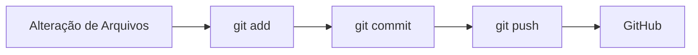

# 🚀 Aula de Git & GitHub - Alpha EdTech

<p align="center">
  
</p>

## 📖 Sobre a Aula

Esta aula tem como objetivo apresentar os principais conceitos de **Git** e **GitHub**, ferramentas fundamentais para o controle de versão e colaboração em projetos de desenvolvimento de software.

Durante a aula, serão abordados desde os conceitos básicos até as operações mais utilizadas no dia a dia de um desenvolvedor.

---

## 🎯 Objetivos

- Entender o que é controle de versão.
- Aprender a utilizar os principais comandos do Git.
- Criar e gerenciar repositórios locais.
- Trabalhar com repositórios remotos no GitHub.
- Realizar commits, branches e merges.
- Colaborar em projetos utilizando GitHub.

---

## 🛠️ Tecnologias Utilizadas

<div align="center">

| Ferramenta | Descrição |
|------------|------------|
| Git | Sistema de Controle de Versão |
| GitHub | Plataforma de Hospedagem de Repositórios |
| Git Bash | Terminal para execução dos comandos Git |

</div>

---

## 📚 Conteúdo Abordado

### 🔹 Configuração Inicial

```bash
git config --global user.name "Seu Nome"
git config --global user.email "seuemail@email.com"
```

### 🔹 Criando um Repositório

```bash
git init
```

### 🔹 Verificando o Status

```bash
git status
```

### 🔹 Adicionando Arquivos

```bash
git add .
```

### 🔹 Criando um Commit

```bash
git commit -m "Primeiro commit"
```

### 🔹 Conectando ao GitHub

```bash
git remote add origin https://github.com/usuario/repositorio.git
```

### 🔹 Enviando Alterações

```bash
git push -u origin main
```

### 🔹 Atualizando o Projeto

```bash
git pull origin main
```

---

## 🌳 Trabalhando com Branches

### Criar uma nova branch

```bash
git branch feature/minha-feature
```

### Trocar de branch

```bash
git checkout feature/minha-feature
```

ou

```bash
git switch feature/minha-feature
```

### Criar e trocar de branch

```bash
git checkout -b feature/minha-feature
```

### Fazer merge

```bash
git merge feature/minha-feature
```

---

## 📌 Fluxo Básico do Git



---

## 💡 Boas Práticas

✅ Fazer commits pequenos e frequentes

✅ Utilizar mensagens de commit claras

✅ Criar branches para novas funcionalidades

✅ Sempre atualizar a branch principal antes de iniciar uma tarefa

✅ Revisar alterações antes de enviar para o repositório remoto

---

## 📋 Comandos Mais Utilizados

| Comando | Função |
|----------|---------|
| `git status` | Verificar alterações |
| `git add .` | Adicionar arquivos |
| `git commit -m ""` | Criar commit |
| `git push` | Enviar alterações |
| `git pull` | Atualizar projeto |
| `git branch` | Listar branches |
| `git checkout` | Trocar de branch |
| `git merge` | Mesclar branches |
| `git log` | Histórico de commits |

---

## 👨‍💻 Exercício Prático

1. Criar um repositório local.
2. Criar um arquivo `README.md`.
3. Realizar o primeiro commit.
4. Criar um repositório no GitHub.
5. Conectar o repositório local ao remoto.
6. Enviar o projeto para o GitHub.

---

## 🎓 Alpha EdTech

Desenvolvendo profissionais preparados para os desafios do mercado de tecnologia.

⭐ Não esqueça de dar uma estrela no repositório caso o conteúdo tenha ajudado você!

---

<p align="center">
Feito com ❤️ para os alunos da Alpha EdTech
</p>